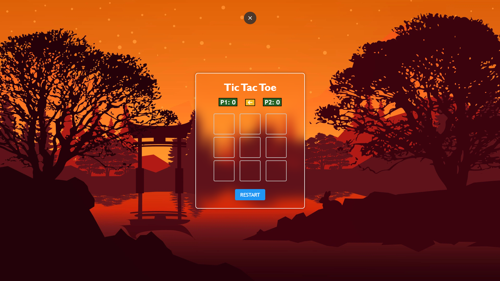

# Tic Tac Toe

## Description
A simple Tic Tac Toe game built with HTML, CSS, and JavaScript. This project provides an interactive and enjoyable two-player gaming experience.

## Demo
Check out the live demo: [Tic Tac Toe Demo](https://tictactoe-mykel.vercel.app/)

## Preview

## Features
- Clean and user-friendly interface.
- Two-player turn-based gameplay.
- Score tracking for each player.
- Visual indicators for the current turn.
- Winning combinations highlighting.
- Reset button to restart or start a new game.

## Getting Started
1. **Clone the Repository**: `git clone https://github.com/your-username/tic-tac-toe.git`
2. **Open the HTML File**: Open the `index.html` file in your web browser.

## How to Play
1. Click on the grid cells to make your move.
2. The game alternates turns between Player 1 (X) and Player 2 (O).
3. The first player to get three in a row wins.
4. If the grid is filled without a winner, the game is declared a draw.

## Files
- **index.html**: The main HTML file containing the structure of the Tic Tac Toe game.
- **styles.css**: The CSS file styling the appearance of the game.
- **index.js**: The JavaScript file handling game logic, player turns, and scoring.